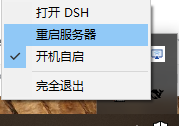
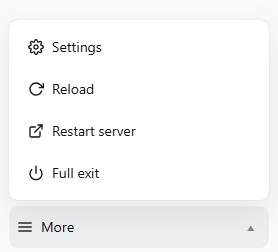
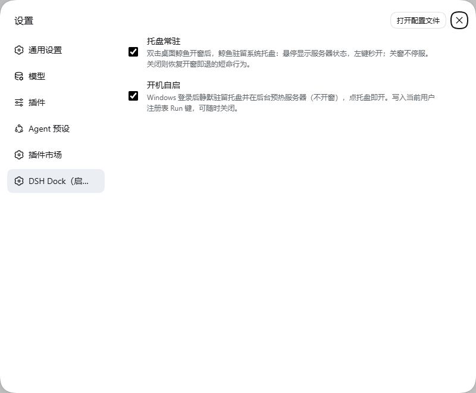

<sub>🌐 <a href="README.md">中文</a> · <b>English</b></sub>

<div align="center">

# DSH Dock (dsh-dock)

> *"Double-click the desktop whale, get full-screen DSH — then it lives in your notification area: status at a glance, restart in one click, no terminal, no `npx dsh web`, no digging through the process list for port 3080."*

[](LICENSE)

[](https://github.com/deepseek-ai/deepseek-harness)
[](https://github.com/topics/dsh-plugin)

**Collapses "open a terminal → type the command → paste the token → press F11 → hunt the process list to kill the server" into: double-click the whale to open, a tray whale that reports status, one-click server restart, and a two-step full exit. Single-file native exe, no build step on install, zero dependencies, loopback-only traffic.**

[Results and live tests](#results-and-live-tests) · [Quick start](#quick-start) · [What it can do](#what-it-can-do) · [Security boundaries](#security-boundaries) · [Verification and testing](#verification-and-testing)

</div>

---

<p align="center">



<sub>After the window opens the whale settles into the notification area: hover for server status, left-click to reopen, right-click for restart / autostart / exit — "restart the server", several times a day, shrinks from a process-list hunt to one click.</sub>

</p>

---

## What problem does it solve

If you use DeepSeek Harness daily, this probably repeats every day: open a terminal → `npx dsh web --no-open` → copy the token URL → paste it into a browser → press F11. Want a restart? `Get-NetTCPConnection -LocalPort 3080` to find the PID, `Stop-Process`, then do the whole thing again.

The problem isn't that any single step is hard — it's that **every step needs your hands**. "Restart" happens several times a day, yet it's buried in the process list.

DSH Dock collapses the ritual into three entry points plus one resident status seat:

- **One black whale icon on the desktop**: server running → opens full-screen directly; server down → starts it silently and opens the window once ready; after opening, the whale **settles into the system tray** (can be turned off in the settings page).
- **The tray whale (status entry, v0.4.0)**: hover shows "running / starting / stopped"; left-click reopens instantly; right-click menu = Open DSH · Restart Server · ☑ Start on boot · Full Exit.
- **One "Whale Bay" menu in the sidebar**: Surface (reload the UI, server untouched) / Migrate (restart the server — it always returns) / To the Bay (full exit, two-step confirm) — three actions borrowed from the whale's behavior repertoire, with the functional legend on hover. Settings is not in the menu — it stays at the native sidebar-footer entry, where the dsh-dock settings page (tray residency / start on boot) lives inside the Settings dialog.
- **Exit cleans up after itself**: Full Exit → the page closes itself → the server stops gracefully (whole-tree dispose) → sessions persist in real time; double-click the whale next time and pick up where you left off.

> All plugin chrome (menu, settings page, exit overlay) follows the harness display language and re-renders live on a language switch (中文 menu shown in `menu.png`).

---

## Results and live tests

> Every image and number in this section is a **real run artifact**; the re-capture recipes live in the repo: [docs/screenshots/CAPTURE.md](docs/screenshots/CAPTURE.md).

### Desktop app (double-click to launch)

<p align="center"></p>

After install, a "DSH Harness.exe" app appears on the desktop — **double-clicking it is the whole entry** (not a shortcut): server running → silent full-screen window; server down → the whale card takes over. The icon is the black whale (compiled into the exe; the shot above is the embedded 512×512 frame of `assets/dsh-dock.ico`, transparent background).

### Sidebar "Whale Bay" menu (pops upward on click)

As of v0.5 the sidebar footer gains a three-wave icon button, "**Whale Bay**" (鲸湾) — the whale's rest-and-reset bay. It opens three actions borrowed from the whale's behavior repertoire: **Surface** (reload the UI — same effect as Ctrl+Shift+R, server untouched), **Migrate** (restart the server; it always returns), and **To the Bay** (full exit; two-step accidental-click guard, auto-disarms after 4 seconds). The menu keeps the metaphor pure — the functional legend rides the native hover tooltip and aria-label — and its icons (wind / migratory loop / moon) compose one small seascape with the wave trigger. The menu renders as a plain neighbor entry in the sidebar footer slot — no native DOM is moved or hidden — so it coexists with every other sidebar plugin (including dynamic Cordis plugins); its labels follow the harness display language live (中文: 换气 / 洄游 / 归湾).

| Menu open | After clicking "To the Bay" once |
|---|---|
|  |  |

> Both are real v0.5 captures: the open Whale Bay menu (Surface / Migrate / To the Bay) and the armed two-step state (确认归湾?) after one click on "To the Bay". 中文 menu shown in `menu.png`. Re-capture in one command: `node scripts/capture-whale-menu.mjs --en`.

### Tray whale (resident status entry, v0.4.0)

After opening the window the whale stays in the notification area: hover tooltip shows the server state; left-click reopens instantly; **Restart Server / ☑ Start on boot** live on the right-click menu; the tray's "Full Exit" is a single click (the right-click itself is the intent; the sidebar keeps its two-step guard). A named mutex guarantees at most one icon at any time — whichever of double-click / boot autostart / tray arrives first stays.


Tray right-click menu (top to bottom): Open DSH · Restart Server · ☑ Start on boot · Full Exit (single click).

### Settings page ("DSH Dock（启动器）" section in the Settings dialog, v0.4.0)



All plugin settings in one place: the native "Settings" entry at the sidebar bottom → the "DSH Dock（启动器）" section in the left list → two toggles (**Tray residency** / **Start on boot**, each with a description). Their state stays in sync with the tray's right-click checkmark in real time.

### Cold-start card (double-click the whale while the server is down)


A dark translucent rounded glass card; the centered black whale is a breathing light (brightness pulsing 35%↔100% on a cosine curve — no progress bar, no caption). On failure the whale stops breathing, the text turns red, and the log path plus a close button appear.

> Screenshot provenance: the card is a real render of the **prebuilt launcher** (`assets/dsh-dock-launcher.exe`) under a demo config (temporary `launcher.ini` pointing at the real server on 3080 + a dead token line, read-only probing, no real log writes), captured in the "connecting" state. Re-capturable via `pwsh -File scripts/capture-demo-card.ps1`.

### Several DSH installs? Pick on the cold card (since v0.3.3)


With several dsh installs (global / npx cache / source checkouts), the cold-start card draws its own candidate list (version · source · path) and starts the one you pick; no click for 10 seconds auto-uses the last successful choice (or the highest version); switching never rewrites a single file; with zero candidates it offers a one-click npx fetch. Re-capturable via `pwsh -File scripts/capture-multidsh.ps1`.

### Measured numbers (this machine)

> This machine = Windows 11 + 360 AV; method in [Verification and testing](#verification-and-testing). Engine-related timings will differ on other machines; the plugin's own overhead stays ~0.75s.

| Scenario | Measured | Notes |
|---|---|---|
| Server running, double-click the desktop app | **Edge new process ~0.6–1.5s** | Native exe direct (launch ~100ms + local HTTP verify ~10ms), no wscript layer |
| Server down, double-click the desktop app | **Branded card in ~0.3s**, window opens when the server is ready | Card and launcher are the same native exe (prebuilt and committed — no compile on install), no PowerShell engine wait |
| Server cold start to port ready | ~10–13s | dsh's own startup time (measured 10.6s / 13.2s) |
| "Full Exit" click to process actually gone | **~1–7s** | v0.3.7+ takes the graceful path (`ctx.appExit` whole-tree dispose, then natural exit; 7s is the watchdog ceiling, most exits land ~2s); hosts without `appExit` fall back to the hard kill |

---

## Quick start

Prerequisites: Windows 10/11 + the DSH `web` profile + Edge (falls back to the default browser if missing). No Node setup needed — the installer auto-detects a usable Node (≥ 22.19).

```bash
dsh plugin --profile web add github:UnknowCao/dsh-dock#v0.5.0
```

After restarting the server there is **nothing to do**: on activation the plugin extracts its parameters from the environment (its own listening port, Node path, start command); within ~2s the desktop gets "DSH Harness.exe" (black whale icon) and the sidebar gets the "Whale Bay" menu. Daily routine: **double-click the whale to open, exit from the menu**. "Full Exit" shuts the server down gracefully (the whole Cordis tree is disposed before a natural exit); hosts without `ctx.appExit` fall back to the legacy hard kill.

**Upgrading from v0.4?** v0.5 touches only the sidebar menu: renamed to "Whale Bay", narrowed to Surface (reload) / Migrate (restart the server) / To the Bay (full exit), each with a hover legend (Settings returns to the native sidebar-footer entry; the settings page itself is unchanged); fixes the page freeze when another plugin (e.g. the Cordis panel badge) also occupies the sidebar footer slot; menu labels now follow the harness language live. Tray, restart, autostart and the settings page are unchanged.

For customization (rename / different port), tell the agent:

```text
Rename the DSH desktop app to XX / install it on port 3081
```

Uninstall: delete the desktop `DSH Harness.exe` and `~\.dsh\launcher\`; remove the dependency and bundle entries from the profile. Uninstalling never deletes files automatically.

---

## What it can do

| Capability | Delivers | Trigger |
|---|---|---|
| One-click launch · fast path | Server running: silently opens **full-screen** (dedicated Edge app window, no card flash) | Double-click the desktop app |
| One-click launch · cold path | Branded card (breathing whale) → silent start → window on ready | Double-click the desktop app |
| Dedicated app window | Own Edge profile: not a tab in your main browser, 30-day login state | Automatic |
| Sidebar "Whale Bay" menu (v0.5 redesign) | Surface (reload the UI) / Migrate (restart the server) / To the Bay (full exit, two-step confirm) behind one wave button in the sidebar footer, each with a hover legend; popup is a React portal | "Whale Bay" at the sidebar bottom |
| Coexists with other sidebar plugins (v0.5) | Renders as a plain neighbor entry — zero DOM relocation, no hidden native triggers; the footer slot stacks vertically so full-row entries (e.g. the Cordis panel badge) and Whale Bay each get their row; no more page freeze | Automatic |
| Follows the UI language (v0.5) | Menu / settings page / exit overlay strings register into the harness locale; a language switch re-renders live (≤ v0.4 ignored it) | Harness language setting |
| Exit closes the window | Brief page linger, window closes, server stops silently, sessions persist in real time | Menu "To the Bay" ×2 |
| Guarded / race-free | Two-step Full Exit; double-click right after exit waits for the old process to die before cold-starting; single-instance lock on cold start; port-occupied-but-not-ready fails loudly instead of hanging | Automatic |
| Single file · no build · zero deps | The desktop entry is the **native exe itself** (not a shortcut); prebuilt and committed — installs need no csc; runtime talks to loopback only | Automatic |
| Install on activation | ~2s after activation the full suite lands, all parameters (port/Node/start command) auto-detected from the environment; content-compare idempotency, refreshed automatically on plugin upgrade | `dsh plugin add` + restart |
| Pick which DSH to start | With several dsh installs (global / npx cache / source), the cold-start card shows a picker; no click for 10s auto-uses the last successful version (or the highest); switching never rewrites any file; zero-candidate case offers a one-click npx fetch | Double-click the whale (multi-candidate) |
| Tray residency · status entry (v0.4.0) | After opening the window the whale stays in the notification area: hover shows "running / starting / stopped" status, left-click reopens instantly; closing the window never stops the server; a named mutex guarantees at most one icon ever | Automatic (on by default, toggle in the settings page) |
| One-click server restart (v0.4.0) | Kill the listener → wait the port dead → start again → auto-open on ready (replaces the old ~15s "exit and double-click" ritual with one click) | Tray right-click or Whale Bay menu "Migrate" |
| Boot autostart (v0.4.0, off by default) | Checking writes an HKCU Run entry: after login the whale sits in the tray with the server preheated in the background, **no window**; click the tray to open instantly | Tray right-click "Start on boot" or the settings page |
| Plugin settings page (v0.4.0) | A proper section **inside the Settings dialog** (same seat other plugins' settings pages use): tray residency / boot autostart | Settings dialog → "DSH Dock（启动器）" |

---

## Compared to doing it by hand

| Scenario | By hand | dsh-dock |
|---|---|---|
| Open | Terminal `npx dsh web` + grab the token + paste into a browser | Double-click the icon — token grabbed, full-screen window opened |
| Window shape | Lost among browser tabs | Dedicated app window, straight to full screen (own profile) |
| Reload the UI | — (restart the whole server) | One "Surface" click in the Whale Bay menu; server untouched |
| Restart the server | Full exit → wait for the port to die → double-click (~15s ritual) | Tray right-click or Whale Bay menu "Migrate" — old windows close first, one new one opens on ready |
| Exit | Hunt the process list for the PID, then kill | Sidebar two-step "To the Bay" (graceful stop + window close) or one tray click |
| Double-click again | May spawn a second server | Idempotent: already running → just open the window |

## How it differs from other launcher approaches

The dsh-plugin ecosystem already has several desktop clients and launchers (see the indexes at the bottom). dsh-dock's bet: **not another program — a plugin inside the dsh you already have**.

| Dimension | dsh-dock's take |
|---|---|
| Shape | A DSH plugin: one `dsh plugin add` command, rides your existing dsh, no second runtime |
| Upgrades | Upgrading the plugin upgrades it; the launcher suite refreshes itself on every activation (content-compared, idempotent) |
| Exit / restart | Via host web routes: graceful exit disposes the whole tree; restart runs in the independent tray process; sessions persist in real time |
| In-UI control | The Whale Bay sidebar menu + a settings page inside the Settings dialog, same surface as the Web UI, coexisting with other plugins |
| Multiple dsh versions | Pick right on the cold-start card (global / npx cache / source checkouts) |
| Trust surface | Zero install hooks, a single prebuilt exe, loopback-only traffic (see Security boundaries) |

In one line: if you already use dsh's Web UI and want "desktop double-click + tray residency + a clean exit" rather than yet another client — this is it.

More plugins in the ecosystem indexes: [dsh-plugin topic](https://github.com/topics/dsh-plugin) · [Oh-My-DSH](https://github.com/NoWint/Oh-My-DSH) · [awesome-deepseek-harness](https://github.com/0xsline/awesome-deepseek-harness).

---

## Security boundaries

- **Loopback only**: the exit endpoint `/launcher/api/stop` accepts local/trusted-origin + same-origin requests only; cross-site requests get a flat 403 — nothing exposed externally
- **Never touches session data**: exit relies on DSH's real-time persistence; the plugin does not read or write sessions in `$DSH_HOME`
- **No credentials read or sent**: the token only flows between the local log and the local Edge launch arguments
- **No wrong kills**: exit uses "own-PID kill + netstat fallback"; if the manifest points at some other process, it never acts
- **Zero lifecycle scripts on install**: `package.json` has no preinstall/install hooks — installing runs no arbitrary code; if a same-named desktop file exists that is **not** this plugin's, it refuses to overwrite and reports loudly
- **Full Exit has a two-step confirmation**; startup failures surface the reason plus the log path
- **No resident background service** (as of v0.4.0): the double-click chain remains a single native exe; the **tray residency** is a visible, user-toggleable whale process (on by default) with loopback-only traffic and no credential access. Turning "tray residency" off fully restores the v0.3.x short-lived process model
- **Autostart writes only the per-user registry**: boot autostart is one `dsh-dock` value under `HKCU\Software\Microsoft\Windows\CurrentVersion\Run` (pointing at the suite exe with `--boot`) — no admin rights needed, removing it deletes the entry
- **Settings routes share the same fence**: `/launcher/api/settings/{get,set}` goes through the same loopback/same-origin trust check as the exit and restart endpoints; cross-site gets a 403

### Known limitations (stated up front, not defects)

- Windows only (macOS/Linux planned)
- Manually started server + a fresh Edge profile: no token in the log to grab — log in once with a token URL (login state lasts 30 days)
- "Full Exit" from an ordinary browser tab may be blocked from auto-closing → an overlay explains it; close manually once. Windows opened by the desktop app close automatically
- The web chrome (menu / settings page / exit overlay) follows the harness display language live; the native tray exe is not localized yet (Chinese labels; OS-driven context menu styling)
- Sidebar "Migrate" (restart server) needs the resident tray to execute (the host cannot restart its own death); when no tray is present it prompts you to double-click the whale first
- Tray "Restart Server" deliberately closes every dsh-dock window before booting — their tokens died with the old process, so a refresh cannot resurrect them

---

## File structure

```
dsh-dock/
├── index.js                 # Host: launcher_install tool + exit/settings/restart routes + baked launcher.ini/start-server.cmd + desktop exe placement
├── client.js                # Client: sidebar "Whale Bay" menu (plain neighbor entry + React portals) + "DSH Dock（启动器）" settings page in the Settings dialog + exit auto-close
├── cordis.patch.yml         # bundle patch: inserts the plugin row into the composition
├── package.json             # package manifest (name: dsh-dock)
├── regen-launcher.mjs       # maintenance: regenerate the launcher suite outside the harness
├── candidates.mjs           # shared: multi-DSH detection + suite materialization (activation + T2 refresh)
├── dsh-dock-refresh.mjs     # cold-start refresh script (T2, run by the exe via node; deployed next to candidates.json)
├── dsh-dock-v0.5.0-release-notes.md  # v0.5.0 release notes (Whale Bay redesign / coexistence / live locale)
├── dsh-dock-v0.4.0-release-notes.md  # v0.4.0 release notes (the tray/restart/autostart/settings story)
├── src/
│   └── DshDockLauncher.cs   # the launcher's single implementation: fast-path silent window + cold card + health gate + exit races + single-instance lock + tray
├── assets/
│   ├── dsh-dock-launcher.exe # prebuilt launcher (output of scripts/build-launcher.ps1, committed — installs need no compiler)
│   ├── dsh-dock.ico         # desktop app whale icon (compiled into the exe)
│   └── whale.png            # card whale source bitmap (whiteness remap)
├── docs/
│   └── screenshots/
│       ├── desktop-shortcut.png    # desktop app icon close-up (black whale 512×512, transparent)
│       ├── menu.png / menu-en.png  # Whale Bay menu captures (v0.5, scripted)
│       ├── menu-exit-armed.png     # "Full Exit" two-step confirmation state
│       ├── tray-menu.png           # tray right-click menu, real capture
│       ├── settings-section.png    # the "DSH Dock（启动器）" section inside the Settings dialog
│       ├── cold-card.png           # cold-start card, real capture (re-recorded under the demo config)
│       ├── cold-card-multidsh.png  # the multi-DSH candidate picker, real capture
│       └── CAPTURE.md              # re-capture recipes (manual menu shots + scripted runs)
├── scripts/
│   ├── build-launcher.ps1        # compile src/DshDockLauncher.cs → assets/dsh-dock-launcher.exe (dev-time)
│   ├── capture-demo-card.ps1     # cold-card re-capture: demo ini + dead token → burst-shoot, pick the brightest whale phase
│   ├── capture-multidsh.ps1      # multi-DSH picker re-capture
│   ├── capture-whale-menu.mjs    # Whale Bay menu + settings page one-command re-capture (CDP-driven Edge, incl. language switch + restore)
│   └── verify-health-gate.ps1    # regression: a dead token (401) must never open a window
├── LICENSE
├── README.md                # Chinese README (primary)
└── README.en.md             # this file
```

On install, generated under `~\.dsh\launcher\` (runtime artifacts, not committed):

`dsh-dock-launcher.exe` (the launcher itself), `launcher.ini` (runtime config read by the exe, base64 values), `start-server.cmd` (hidden spawner for the default candidate, waits for the port to be free before starting to avoid log truncation), `start-server.<id>.cmd` (one per remaining candidate), `candidates.json` (the candidate list: version/source/path/batch), `candidates.mjs` + `dsh-dock-refresh.mjs` (deployed copies of the refresh scripts, run by the exe via node before a cold start), `launcher-state.json` (the exe's last choice and similar state), `launcher.json` (host/port/desktop-dir/**trayPid** cache for the exit route and idempotency checks), `settings.json` (user settings: tray residency), `dsh-dock.ico`, `whale.png`, `.stopping` (exit-in-progress marker), `.starting.lock` (cold-start single-instance lock), `.restart.request` (sidebar Restart Server → tray executor), `stop.log` (append-only exit-lifecycle diagnostics), `dsh-server.log(.err)`, `edge-app-profile\` (the dedicated Edge profile for the full-screen window); the desktop receives `DSH Harness.exe` (a copy of the same binary). All of these are **generated/refreshed automatically** on plugin activation.

---

## Verification and testing

Spend 5 minutes self-verifying after install (every step lists its expected outcome):

1. **One-click open**: double-click the desktop "DSH Harness.exe" → with the server running, a full-screen window appears within 1–2s (no card), then the **whale settles into the notification area**.
2. **Tray**: hover the whale → tooltip "DSH 运行中 · 端口 3080"; left-click reopens instantly; right-click shows the four items (Open / Restart Server / ☑ Start on boot / Full Exit).
3. **Sidebar menu**: click "Whale Bay" at the sidebar bottom → three items (Surface / Migrate / To the Bay), each with a hover legend; the first "To the Bay" click turns the item red reading 确认归湾? ("Confirm: to the bay?"), a second click executes. The native "Settings" at the sidebar bottom → "DSH Dock（启动器）" in the dialog → its two toggles stay in sync with the tray's checkmark (change one, the other follows).
4. **Restart server**: Whale Bay menu "Migrate" or tray "Restart Server" → every dsh-dock window closes first → ~10–15s later exactly one new full-screen window opens.
5. **Cold start**: sidebar "To the Bay" ×2 (or one tray click) → wait until `Get-NetTCPConnection -LocalPort 3080 -State Listen` prints nothing → double-click the desktop app → breathing-whale card → server ready → full-screen window → card fades out.
6. **Race check**: during step 5's server startup (within ~10s), double-click once more → there should be exactly one server, one tray, and a usable window at the end.

---

## Implementation notes (for readers who want depth)

- **v0.5 coexistence rewrite**: the menu registers as a plain `sidebar.footer.action` neighbor entry and renders exactly where the slot mounts it — zero DOM relocation, no hidden native triggers. v0.4 physically relocated its button DOM into the sidebar footer container and hid the native Settings trigger with inline styles, so any later footer entry from another plugin (e.g. the Cordis panel badge) deadlocked React reconciliation and froze the page; v0.5 moves the popup and the exit overlay into React portals, plus one stacking CSS rule over the slot's structural `[data-slot]` attribute so full-row entries and Whale Bay each get their row
- **Live language switching (v0.5)**: `locale` is a hard dependency (Cordis waits for the service; dictionaries register before first render); a language switch re-renders the chrome via a locale subscription (≤ v0.4 ignored harness language switches)
- **Whale-behavior naming (v0.5)**: the three actions borrow the whale's ecological repertoire — Surface (reload), Migrate (restart; it always returns), To the Bay (full exit & rest); the menu keeps the metaphor pure while the functional legend rides the native title tooltip and aria-label at zero visual cost; the wind / migratory-loop / moon icons compose one seascape with the three-wave trigger
- **Single exe, single implementation**: fast path, cold card, health gate, exit races, single-instance lock — all compiled into the one file `src/DshDockLauncher.cs`. The retired .lnk→wscript→VBS→HTA four-layer chain (the same logic implemented three times — a historical bug nursery) is gone
- **Prebuilt + runtime config**: the exe is committed (`assets/dsh-dock-launcher.exe`), installs need no csc; every machine-specific path (logs/batch/Edge profile/markers/whale art) is baked into `launcher.ini` (base64 values — safe for Chinese usernames)
- **HTTP 200 health gate (with cookie semantics)**: DSH answers a valid token URL with **303 + Set-Cookie → /**; a browser follows it to 200. The gate replicates this chain with a CookieContainer — a stale token (bare 401) never opens a window
- **Exit/start race absorption**: while `.stopping` is fresh, the launcher waits for the port to die before cold-starting; `.starting.lock` single-instance lock prevents double starts, with a 60s crash takeover
- **Zero-blocking animation**: the TCP probe (a dead port blocks up to 700ms), the log scrape, and the health-gate HTTP all poll on a background thread — the UI thread only paints, so the breathing lamp stays smooth through the whole cold start, regardless of machine speed
- **Multi-DSH selection (one baked .cmd per candidate)**: candidates = global prefixes + npx cache (`_npx`) + source checkouts, sorted version → source → path; each candidate owns a batch file, switching only picks which one runs — **never rewrites any .cmd**; before a cold start the exe runs the T2 refresh script (~0.2s) so a dsh installed minutes ago is already selectable; a failed refresh falls back to the stale list flagged "may be outdated"
- **Fail loudly instead of hanging**: port occupied but the page never 200s → within ~24s it reports "the previous session may not have fully exited" + the log path
- **Tray residency (v0.4.0)**: `DshTray` lives in the same exe — after opening a window the process stays as the tray (with `--boot` it preheats the server silently, no window). The tray stamps its PID into `launcher.json` (`trayPid`); the sidebar exit kills it synchronously BEFORE the response (name-checked, so a recycled PID is never hit); a double-click while the tray is running does the fast-path open and exits — **zero IPC**; a `Local\dsh-dock-tray-<port>` named mutex guarantees at most one icon ever (across the suite and desktop copies)
- **Restart Server = the tray is the executor (v0.4.0)**: the sidebar item writes `.restart.request`; the resident tray polls it and runs the full restart sequence — the host cannot restart its own death. Restart closes every old dock window by `--user-data-dir` identity (their tokens died with the old process), then opens exactly one new window on ready
- **Window closing by identity, not bookkeeping (v0.4.0)**: WMI enumerates msedge command lines and closes every one carrying the dedicated Edge profile (graceful first, force-kill after a short grace) — a tray instance swap mid-session never orphans old windows
- **Graceful exit (v0.3.7+)**: `/launcher/api/stop` prefers `ctx.appExit` (whole-tree dispose, natural exit, 7s watchdog ceiling) and falls back to the hard kill only on hosts without `appExit`; every exit branch is recorded in the append-only `stop.log` (the cold-start batch cannot truncate it)
- **Install on activation**: ~2s after `apply()` the full suite lands — the port comes from **the own PID's LISTENING socket** (netstat, ~100ms), Node and the start command via probe chains; when already up to date, content comparison skips ahead (a few file reads — zero PowerShell, zero writes)
- **Diagnostics hook**: set `DSH_DOCK_DIAG=1` and the launcher appends its decision/crash trail to `%TEMP%\dsh-dock-diag.log` (zero overhead otherwise)
- After changing the `index.js` recipe or rebuilding the exe, regenerate the suite with `node regen-launcher.mjs`

---

## Acknowledgements and disclaimer

- This plugin depends on [DeepSeek Harness](https://github.com/deepseek-ai/deepseek-harness) itself; the whale brand assets belong to it.

## License

[MIT](LICENSE)

---

<div align="center">

*Double-click the whale to open — Surface, Migrate, to the Bay 🐋*

</div>
