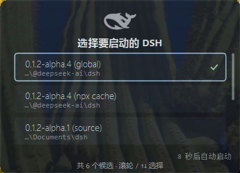

<sub>🌐 <b>中文</b> · <a href="README.en.md">English</a></sub>

<div align="center">

# DSH Dock(dsh-dock)

> *「双击桌面鲸鱼，秒开全屏 DSH——不用再开终端敲 `npx dsh web`，也不用去进程列表里找 3080。」*

[](LICENSE)

[](https://github.com/deepseek-ai/deepseek-harness)
[](https://github.com/topics/dsh-plugin)


**把「开终端 → 敲命令 → 粘 token → 手动全屏 → 翻进程列表杀进程」收成桌面一个鲸鱼图标 + 侧栏一个「更多」菜单。单文件原生 exe、免编译安装、零依赖、只与本机通信。**

[效果与实测](#效果与实测) · [快速开始](#快速开始) · [能做什么](#能做什么) · [触发方式](#触发方式) · [与同类插件有什么不同](#与同类插件有什么不同) · [安全边界](#安全边界) · [验证与测试](#验证与测试)

</div>

---

<p align="center">


<sub>侧栏一个「更多」菜单:⚙ 设置 · ⟳ 重启/刷新 · ⏻ 完全退出(两步防误触)——打开与退出第一次收进同一处。</sub>

</p>

---

## 你什么时候需要它

如果你是 DeepSeek Harness 的日常用户，下面这段大概每天重复:开终端 → `npx dsh web --no-open` → 记下那串 token URL → 粘进浏览器 → 手动按 F11。想重启?先 `Get-NetTCPConnection -LocalPort 3080` 找到 PID 再 `Stop-Process`，然后从头再来一遍。

问题不在哪一步特别难，而在**每一步都要你亲手做**——尤其「重启/刷新」这种一天好几次的高频动作，却藏在进程列表里。

DSH Dock 把整件事收进两个入口:

- **桌面一个黑鲸鱼图标**:服务器在跑 → 直接全屏打开;没在跑 → 自动拉起，就绪后开窗。
- **侧栏一个「更多」菜单**:⚙ 设置 / ⟳ 重启/刷新 / ⏻ 完全退出，全部在同一处。
- **退出自动收尾、优雅停机**:点「完全退出」→ 两步确认 → 页面自动关闭 → 服务进程**优雅退出**(整棵 Cordis 树 dispose 后自然终止，~1s)→ 会话实时保存，下次双击鲸鱼直接续上。

> 想要更长的选择时间、改图标名、换端口?直接对 Agent 说一句话即可(见[触发方式](#触发方式))。

---

## 效果与实测

> 本节图片与数字均为**真实运行产物**，重录方法全部入库:[docs/screenshots/CAPTURE.md](docs/screenshots/CAPTURE.md)。

### 桌面程序(双击即启动)

<p align="center"></p>

安装后桌面出现「DSH Harness.exe」桌面程序，**双击它本身就是入口**(不是快捷方式):服务器在跑 → 静默全屏开窗;没在跑 → 鲸鱼卡片拉起。图标为黑鲸鱼(编译进 exe，上图取 `assets/dsh-dock.ico` 内嵌的 512×512 帧，透明底)。

### 侧栏「更多」菜单(点击后向上弹出)

| 打开菜单 | 点一次「完全退出」后 |
|---|---|
|  |  |

右图是两步防误触的第二步:第一次点「完全退出」，按钮变「确认完全退出?」，4 秒内再点才执行。

从上到下:⚙ **设置**(打开原设置弹窗)、⟳ **重启/刷新**(重载界面，等效 Ctrl+Shift+R，**服务器不动**)、⏻ **完全退出**(两步防误触，优雅停机)。

### 冷启动卡片(服务器没在跑时双击鲸鱼)

**单候选**(一个 DSH):深色半透明圆角玻璃卡，居中的黑鲸鱼即呼吸灯(亮度 35%↔100% 余弦起伏，无进度条、无字标);失败时鲸鱼停呼吸、文字转红并给出日志路径与关闭按钮。


**多候选**(多份 dsh 时):同一张卡片内呈现**与卡片同风格的自绘候选列表**——每行「版本 · 类型 + 安装目录末尾」，选中项描边 + 对勾，悬停高亮;`↑↓`/滚轮选择、`Enter/Space` 确认、`Esc` 取消;底部右对齐倒计时、支持任意数量候选滚动、0 候选时可一键 npx 拉取。



### 实测数字(本机)

> 本机 = Windows 11 + 360 安全软件环境;方法见 [验证与测试](#验证与测试)。换机器后**引擎相关耗时**会变，插件自身耗时 ~0.75s 稳定。

| 场景 | 实测 | 说明 |
|---|---|---|
| 服务器在跑，双击桌面程序 | **Edge 新进程 ~0.6–1.5s** | 原生 exe 直连(启动 ~100ms + 本机 HTTP 验证 ~10ms)，无 wscript 层 |
| 服务器没跑，双击桌面程序 | **品牌卡片 ~0.3s 出现**，服务器就绪后自动开窗 | 卡片与启动器同一原生 exe(预编译入库，安装免编译)，无 PowerShell 引擎等待 |
| 服务器冷启动至端口就绪 | ~10–13s | dsh 自身启动耗时(实测 10.6s / 13.2s) |
| 点「完全退出」到进程真正死亡 | **~1s(优雅退出)** | 进程内 `appExit` 整树 dispose 后自然退出，无 PowerShell 杀进程引擎;旧宿主无 `ctx.appExit` 时才回退硬杀 |

---

## 快速开始

前置条件:Windows 10/11 + DSH `web` profile + Edge(缺失时回落默认浏览器)。无需 Node 配置——安装时自动探测可用 Node(≥ 22.19)。

```bash
dsh plugin --profile web add github:UnknowCao/dsh-dock#v0.3.7
# 已在用旧版则: dsh plugin --profile web add github:UnknowCao/dsh-dock#v0.3.7
```

重启服务器后**无需任何操作**:插件激活时自动从环境提取参数(自身监听端口、Node 路径、启动命令)，~2 秒内桌面出现「DSH Harness.exe」(黑鲸鱼图标)+ 侧栏「更多」菜单。日常两步:**双击鲸鱼开，菜单里退**。

想自定义(改名/换端口/调超时)，直接对 Agent 说:

```text
帮我把 DSH 桌面程序改名成 XX / 装到 3081 端口 / 多候选自动选择改成 15 秒
```

卸载:删桌面 `DSH Harness.exe` 与 `~\.dsh\launcher\`;profile 里移除依赖与 bundle 条目。卸载不会自动删除任何文件。

---

## 能做什么

| 能力 | 交付 | 触发 |
|---|---|---|
| 一键启动 · 快路径 | 服务器在跑:静默**全屏**打开(独立 Edge 应用窗口，无卡片闪现) | 双击桌面程序 |
| 一键启动 · 冷路径 | 品牌卡片(鲸鱼呼吸灯)→ 静默拉起 → 就绪开窗 | 双击桌面程序 |
| 多 DSH 可选启动 | 多份 dsh(全局/npx 缓存/源码)时，冷启动卡片**自绘候选列表**(可滚动、路径尾、选中描边)，10 秒不点自动用上次成功版本(或最高版本);切换零文件重写;0 候选时可一键 npx 拉取 | 双击鲸鱼(多候选时) |
| 独立应用窗口 | 专属 Edge 配置:不并入主浏览器标签页，自带 30 天登录态 | 自动 |
| 优雅退出 | 「完全退出」→ `ctx.appExit` 整树 dispose → 自然退出(~1s)，不再硬杀;页面自动关闭、会话实时保存 | 菜单「完全退出」×2 |
| 持久化退出诊断 | `~/.dsh/launcher/stop.log` 只追加记录每次退出的分支(优雅 / `appExit(0)` 已请求 / watchdog 强退 / 硬杀兜底)，不被冷启动截断 | 自动 |
| 抗误触/抗竞态 | 完全退出两步确认;退出后立刻双击会等待旧进程死透再冷启动;冷启动单实例锁;端口被占却未就绪时明确报错而非干等 | 自动 |
| 单文件 · 免编译 · 零依赖 | 桌面是**原生 exe 本体**(非快捷方式);预编译入库，安装不需要 csc;运行只与本机回环通信 | 自动 |
| 激活即自动安装 | 插件激活后 ~2s 自动落盘全套产物，参数(端口/Node/启动命令)全部环境自探测;内容比对幂等，升级插件自动刷新 | `dsh plugin add` + 重启 |
| 一键重载界面 | 菜单「重启/刷新」= 硬刷新页面，**服务器不动** | 菜单 |

---

## 触发方式

以下说法都可直接触发 `launcher_install` 工具或对应行为(装他、改名、换端口、调超时):

```text
帮我装个桌面启动器 / 桌面图标
帮我把 DSH 桌面程序改名成 XX
装到 3081 端口
多候选自动选择改成 15 秒
我用源码检出跑 dsh，卡片里要能选到它
```

---

## 与手动操作相比

| 场景 | 手动做法 | dsh-dock |
|---|---|---|
| 打开 | 终端 `npx dsh web` + 手抓 token + 粘浏览器 | 双击图标，自动抓 token、全屏开窗 |
| 窗口形态 | 混进浏览器标签页 | 独立应用窗口，直接全屏(专属配置) |
| 重载界面 | ——(只能整个重启服务器) | 菜单一键重启/刷新，服务器不动 |
| 退出 | 翻进程列表找 PID 再杀 | 菜单两步「完全退出」→ 优雅停机、自动关窗 |
| 重复双击 | 可能重复起服务 | 幂等:已在跑就直接开窗 |

---

## 与同类插件有什么不同

同类存在几款 DSH/Claude 桌面壳与启动器(如 [dsh-whale-desktop-launcher](https://github.com/HUITianYi/dsh-whale-desktop-launcher)、[dsh-desktop-shell](https://github.com/zerorigin-studio/dsh-desktop-shell)、[`@ahikl/dsh-desktop`](https://www.npmjs.com/package/@ahikl/dsh-desktop)、[dsh-melody-launcher](https://www.npmjs.com/package/dsh-melody-launcher))。dsh-dock 的差异点:

| 维度 | dsh-dock | 常见同类 |
|---|---|---|
| 退出方式 | **优雅退出**(`ctx.appExit`，整树 dispose 后自然退出) | 多为 `taskkill`/`Stop-Process` 硬杀 |
| 退出诊断 | **`stop.log` 持久化**记录退出分支，不被截断 | 通常没有 |
| 多 DSH 选择 | 卡片内**自绘可滚动候选列表**，展示版本/类型/路径尾 | 下拉框或只能选一个 |
| 安装摩擦 | **`dsh plugin add` 一条命令**、免编译、零依赖、无生命周期脚本 | 常需额外下载/配置 |
| 冷启动竞态 | 单实例锁 + `.stopping` 新鲜度 + 健康闸、明确报错 | 易重复起服务 |

我们不做「全自动解决所有问题」的大词——只把高频两件事(打开、退出)做到最顺手。

---

## 安全边界

- **只监听回环**:退出接口 `/launcher/api/stop` 只接受本机/可信来源 + 同源请求，跨站直接 403，不对外暴露
- **优雅退出优先、硬杀兜底**:有 `ctx.appExit` 走进程内优雅退出;仅旧宿主(无 `appExit`)回退 PowerShell 硬杀
- **不碰会话数据**:退出依赖 DSH 实时持久化，插件不读写 `$DSH_HOME` 里的会话
- **不读不传凭据**:token 只在本地日志与本地 Edge 启动参数间流转
- **防误杀**:进程内退出只退自身;回退硬杀时用「manifest 端口匹配的自 PID + netstat 兜底」，绝不动无关进程
- **候选 batch 校验**:candidates.json 里的 batch 必须是裸文件名，含绝对路径/分隔符即拒绝并回退默认(防篡改触发任意 .cmd)
- **安装零生命周期脚本**:`package.json` 无 preinstall/install 等钩子，安装过程不执行任意代码;桌面已有同名但**非本插件**的文件时，拒绝覆盖并明确报错
- **完全退出有二次确认**;启动失败会亮出原因与日志路径
- **无常驻进程**:双击链路是**单一原生 exe**——探测、token 验证、卡片、开窗全在进程内，零 wscript、零 PowerShell 引擎开销(仅旧宿主回退时短调用一次)
- **诊断开关默认关闭**:`DSH_DOCK_DIAG=1` 才写 `%TEMP%\dsh-dock-diag.log`(含路径/决策轨迹，平时零写入)

### 已知限制(先声明，非缺陷)

- 仅 Windows(macOS/Linux 计划中)
- 手动启动的服务器 + 全新 Edge 配置:日志无 token 可抓，首次需用带 token 的地址登录一次(登录态 30 天)
- 普通浏览器标签页内点「完全退出」，浏览器可能拦截自动关窗 → 弹出提示遮罩，手动关一次即可;桌面程序打开的应用窗口可自动关闭
- 多 DSH 卡片在少数高分屏/合成器环境下，半透明分层窗口的屏幕截图可能不稳定(实机显示不受影响)

---

## 文件结构

```
dsh-dock/
├── index.js                 # Host:launcher_install 工具 + 优雅退出路由 + stop.log + 烤 launcher.ini/start-server.cmd + 放置桌面 exe
├── client.js                # Client:侧栏「更多」菜单(设置 / 重启/刷新 / 完全退出) + 退出自动关窗 + 菜单动效
├── cordis.patch.yml         # bundle 补丁:编排插入插件行
├── package.json             # 包清单(name: dsh-dock)
├── regen-launcher.mjs       # 维护:脱离 harness 重新生成启动套件
├── candidates.mjs           # 共享:多 DSH 候选探测 + 套件落盘(host 激活与 T2 复核共用)
├── dsh-dock-refresh.mjs     # 冷启动前复核脚本(T2,exe 调 node 执行,随插件部署到 launcher 目录)
├── src/
│   └── DshDockLauncher.cs   # 启动器唯一实现:快路径静默开窗 + 冷卡(含多候选自绘列表) + 健康闸 + 退出竞态 + 单实例锁
├── assets/
│   ├── dsh-dock-launcher.exe # 预编译启动器(scripts/build-launcher.ps1 产出,随仓库提交,安装免编译)
│   ├── dsh-dock.ico         # 桌面程序鲸鱼图标(编译进 exe)
│   └── whale.png            # 卡片鲸鱼源位图(白化重映射)
├── docs/
│   └── screenshots/
│       ├── desktop-shortcut.png  # 桌面程序图标特写(黑鲸鱼 512×512 透明底)
│       ├── menu.png         # 侧栏「更多」菜单实拍(README 效果区主视觉)
│       ├── menu-exit-armed.png   # 「完全退出」二次确认态
│       ├── cold-card.png    # 冷启动卡片(单候选)实拍(演示配置重录)
│       ├── cold-card-multidsh.png # 冷启动卡片(多候选自绘列表)实拍
│       └── CAPTURE.md       # 素材重录说明(菜单人工截图 + 脚本重跑)
├── scripts/
│   ├── build-launcher.ps1   # 编译 src/DshDockLauncher.cs → assets/dsh-dock-launcher.exe(开发时)
│   ├── capture-demo-card.ps1     # 冷卡(单候选)截图重录:演示 ini + 失效 token → 连拍取鲸鱼最亮相位
│   ├── capture-multidsh.ps1      # 冷卡(多候选)截图重录:隔离 demo 配置 + 真实窗口矩形取景
│   └── verify-health-gate.ps1    # 回归:失效 token(401)绝不误开窗
├── LICENSE
├── README.md                # 中文主文档
└── README.en.md             # English README
```

安装后生成于 `~\.dsh\launcher\`(运行时产物，不入仓库):

`dsh-dock-launcher.exe`(启动器本体)、`launcher.ini`(exe 读的运行时配置，值 base64 编码)、`start-server.cmd`(隐藏拉起，等端口空闲才启动防日志截断)、`launcher.json`(host/port/桌面目录缓存，供退出路由与幂等检查)、`stop.log`(退出分支诊断，只追加)、`dsh-dock.ico`、`whale.png`、`.stopping`(退出中标记)、`.starting.lock`(冷启动单实例锁)、`dsh-server.log(.err)`、`edge-app-profile\`(全屏窗口专属 Edge 配置);桌面放置 `DSH Harness.exe`(同一二进制副本)。以上在插件激活时**自动生成/刷新**。

---

## 验证与测试

装完花 3 分钟自验(每步期望都写明了):

1. **一键开**:双击桌面「DSH Harness.exe」→ 服务器在跑时 1~2s 内弹全屏窗口(无卡片)。
2. **菜单**:侧栏 ☰「更多」→ 弹入动效;「设置」打开设置;「重启/刷新」页面重载、会话不变。
3. **冷启动**:菜单「完全退出」×2 → 等 `Get-NetTCPConnection -LocalPort 3080 -State Listen` 无输出 → 双击桌面程序 → 鲸鱼卡片 → 服务器就绪 → 全屏窗口 → 卡片淡出;核对 `~\.dsh\launcher\stop.log` 应追加 `graceful path via ctx.appExit` + `requesting appExit(0)`，且无 `watchdog` 行。
4. **抗竞态**:第 3 步服务器启动途中(约 10s 内)再双击一次 → 应只有一个服务器、最终窗口可用。
5. **多候选**:本机存在 ≥2 份 dsh(全局/npx 缓存/源码)时，冷启动卡片应显示自绘候选列表，可滚动、点击或 `↑↓`+`Enter` 选择。

---

## 实现要点(给想了解深度的读者)

- **单 exe 单实现**:快路径、冷卡、健康闸、退出竞态、单实例锁、多候选自绘列表全部编译进 `src/DshDockLauncher.cs` 一个文件——之前 .lnk→wscript→VBS→HTA 四层链(同一逻辑三份实现，正是历史 bug 温床)已退役
- **预编译 + 运行时配置**:exe 随仓库提交(`assets/dsh-dock-launcher.exe`)，安装免 csc;所有机器相关路径(日志/批处理/Edge 配置/标记/鲸鱼图)烤进 `launcher.ini`(base64 值，中文用户名安全)
- **HTTP 200 健康闸(含 cookie 语义)**:DSH 对有效 token URL 回 **303 + Set-Cookie → /**，浏览器跟随落 200;闸带 CookieContainer 复刻这一链路，旧 token(裸 401)绝不误开窗
- **优雅退出**:`/launcher/api/stop` 走 `ctx.appExit`(整树 dispose 后自然退出，~1s)；未命中 `appExit` 时回退 600ms 后硬杀;`stop.log` 用 `logStop()` 只追加记录分支，7s unref watchdog 兜底「dispose 完成但事件循环未排空」的悬案
- **退出/启动竞态吸收**:`.stopping` 新鲜时先等端口死透再冷启动;`.starting.lock` 单实例锁防双启，60s 崩溃接管
- **候选 batch 校验**:`BatchPath` 只允许裸文件名，含 `\`/`/`/绝对路径即拒绝并回退默认批处理，防篡改 `candidates.json` 触发任意 `.cmd`
- **动画零阻塞**:TCP 探针(死端口最长阻塞 700ms)、日志抓取、健康闸 HTTP 全部在后台线程轮询，UI 线程只负责绘制——冷启动全程呼吸灯流畅，卡顿与机器性能无关
- **多 DSH 候选(每个候选一份烤好的 .cmd)**:候选清单 = 全局前缀 + npx 缓存(`_npx`)+ 源码检出，按 版本→来源→路径 排序;每候选一个批处理，切换只换「跑哪个」，**永不重写任何 .cmd**;冷启动前 exe 先跑 T2 复核脚本(~0.2s)保证刚装的 DSH 立即可选，复核失败用旧清单并标「可能已过期」;卡片用自绘列表(悬停/选中高亮、`↑↓`/滚轮/`Enter`/`Esc`、右侧滚动条、**10s** 自动选择用上次成功版本或最高版)
- **明确失败而非干等**:端口被占但页面始终不 200 时，~24s 内报出「上一次会话可能未完全退出」+ 日志路径
- **激活即自动安装**:`apply()` 后 ~2s 落盘全套产物——端口取自**自身 PID 的 LISTENING 套接字**(netstat，~100ms)，Node 与启动命令走探测链;已就绪时内容比对直接跳过(仅几次文件读，零 PowerShell、零写入)
- **诊断钩子**:设置环境变量 `DSH_DOCK_DIAG=1` 后，启动器把决策/崩溃轨迹追加到 `%TEMP%\dsh-dock-diag.log`(平时零开销)
- 改了 `index.js` 配方或重编 exe 后，用 `node regen-launcher.mjs` 重新生成整套启动文件

---

## 致谢与声明

- 本插件依赖 [DeepSeek Harness](https://github.com/deepseek-ai/deepseek-harness) 本体，鲸鱼品牌素材归其所有。

## License

[MIT](LICENSE)

---

<div align="center">

*双击鲸鱼开，菜单里退 🐋*

</div>
