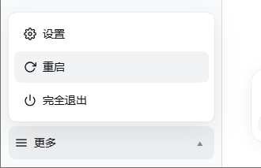
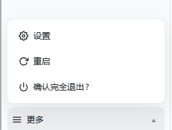
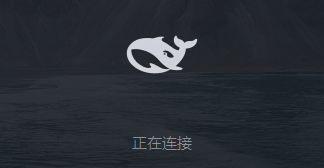

<sub>🌐 <b>中文</b> · <a href="README.en.md">English</a></sub>

<div align="center">

# DSH Dock(dsh-dock)

> *「双击桌面鲸鱼,秒开全屏 DSH——不用再开终端敲 `npx dsh web`,也不用去进程列表里找 3080。」*

[](LICENSE)

[](https://github.com/deepseek-ai/deepseek-harness)
[](https://github.com/topics/dsh-plugin)

**把「开终端 → 敲命令 → 粘 token → 手动全屏 → 翻进程列表杀进程」收成桌面一个鲸鱼图标 + 侧栏一个「更多」菜单。单文件原生 exe、免编译安装、零依赖、只与本机通信。**

[效果与实测](#效果与实测) · [快速开始](#快速开始) · [触发方式](#触发方式) · [能做什么](#能做什么) · [它和同类有什么不同](#它和同类有什么不同) · [安全边界](#安全边界) · [验证与测试](#验证与测试)

</div>

---

<p align="center">



<sub>侧栏一个「更多」菜单:⚙ 设置 · ⟳ 重启 · ⏻ 完全退出(两步防误触)——打开与退出第一次收进同一处。</sub>

</p>

---

## 它解决什么问题

如果你是 DeepSeek Harness 的日常用户,下面这段大概每天重复:开终端 → `npx dsh web --no-open` → 记下那串 token URL → 粘进浏览器 → 手动按 F11。想重启?先 `Get-NetTCPConnection -LocalPort 3080` 找到 PID 再 `Stop-Process`,然后从头再来一遍。

问题不在哪一步特别难,而在**每一步都要你亲手做**——尤其"重启"这种一天好几次的高频动作,却藏在进程列表里。

DSH Dock 把整件事收进两个入口:

- **桌面一个黑鲸鱼图标**:服务器在跑 → 直接全屏打开;没在跑 → 自动拉起,就绪后开窗。
- **侧栏一个「更多」菜单**:⚙ 设置 / ⟳ 重启 / ⏻ 完全退出,全部在同一处。
- **退出自动收尾**:点「完全退出」→ 两步确认 → 页面自动关闭 → 服务器静默停止 → 会话实时保存,下次双击鲸鱼直接续上。

---

## 效果与实测

> 本节四张图与所有数字均为**真实运行产物**,重录方法全部入库:[docs/screenshots/CAPTURE.md](docs/screenshots/CAPTURE.md)。

### 桌面程序(双击即启动)

<p align="center"></p>

安装后桌面出现「DSH Harness.exe」桌面程序,**双击它本身就是入口**(不是快捷方式):服务器在跑 → 静默全屏开窗;没在跑 → 鲸鱼卡片拉起。图标为黑鲸鱼(编译进 exe,上图取 `assets/dsh-dock.ico` 内嵌的 512×512 帧,透明底)。

### 侧栏「更多」菜单(点击后向上弹出)

| 打开菜单 | 点一次「完全退出」后 |
|---|---|
|  |  |

右图是两步防误触的第二步:第一次点「完全退出」,按钮变「确认完全退出?」,4 秒内再点才执行。

从上到下:⚙ **设置**(打开原设置弹窗)、⟳ **重启**(重载界面,等效 Ctrl+Shift+R,服务器不动)、⏻ **完全退出**(两步防误触)。

「完全退出」执行序列:发退出请求 → 页面短促停留 → 自动关窗 → 服务器静默停止。若浏览器拦截自动关窗,会亮出提示遮罩,手动关一次即可。

### 冷启动卡片(服务器没在跑时双击鲸鱼)



深色半透明圆角玻璃卡,居中的黑鲸鱼即呼吸灯(亮度 35%↔100% 余弦起伏,无进度条、无字标);失败时鲸鱼停呼吸、文字转红并给出日志路径与关闭按钮。

> 截图实录:冷卡为**预编译启动器**(`assets/dsh-dock-launcher.exe`)在演示配置下(临时 `launcher.ini` 指向 3080 真服务器 + 失效 token 行,只读探测、不写真实日志)的真实渲染,上方为「正在连接」态。可重录:`pwsh -File scripts/capture-demo-card.ps1`。

### 实测数字(本机)

> 本机 = Windows 11 + 360 安全软件环境;方法见 [验证与测试](#验证与测试)。换机器后**引擎相关耗时**会变,插件自身耗时 ~0.75s 稳定。

| 场景 | 实测 | 说明 |
|---|---|---|
| 服务器在跑,双击桌面程序 | **Edge 新进程 ~0.6–1.5s** | 原生 exe 直连(启动 ~100ms + 本机 HTTP 验证 ~10ms),无 wscript 层 |
| 服务器没跑,双击桌面程序 | **品牌卡片 ~0.3s 出现**,服务器就绪后自动开窗 | 卡片与启动器同一原生 exe(预编译入库,安装免编译),无 PowerShell 引擎等待 |
| 服务器冷启动至端口就绪 | ~10–13s | dsh 自身启动耗时(实测 10.6s / 13.2s) |
| 点「完全退出」到进程真正死亡 | **~5.3s** | 大头是本机 PowerShell 引擎派生(~4.5s,AV 环境);插件脚本本身 ~0.75s |

---

## 快速开始

前置条件:Windows 10/11 + DSH `web` profile + Edge(缺失时回落默认浏览器)。无需 Node 配置——安装时自动探测可用 Node(≥ 22.19)。

```bash
dsh plugin --profile web add github:UnknowCao/unknowCao-dsh-plugin
```

重启服务器后**无需任何操作**:插件激活时自动从环境提取参数(自身监听端口、Node 路径、启动命令),~2 秒内桌面出现「DSH Harness.exe」(黑鲸鱼图标)+ 侧栏「更多」菜单。日常两步:**双击鲸鱼开,菜单里退**。

想自定义(改名/换端口)再对 Agent 说:

```text
帮我把 DSH 桌面程序改名为 XX / 装到 3081 端口
```

卸载:删桌面 `DSH Harness.exe` 与 `~\.dsh\launcher\`;profile 里移除依赖与 bundle 条目。卸载不会自动删除任何文件。

---

## 触发方式

安装全自动(激活即落盘)。装完后,Agent 还能听懂这些话(**用于自定义重装**):

- 「装桌面图标 / 一键启动 / 桌面快捷方式」
- 「双击图标打开怎么这么慢 / 给我加个启动画面」
- 「侧栏底部的更多菜单在哪 / 设置和退出的入口」
- 「重启一下界面 / 相当于按 Ctrl+Shift+R」
- 「完全退出服务器,会话要保留」
- 「把打开的窗口改成全屏」

---

## 能做什么

| 能力 | 交付 | 触发 |
|---|---|---|
| 一键启动 · 快路径 | 服务器在跑:静默**全屏**打开(独立 Edge 应用窗口,无卡片闪现) | 双击桌面程序 |
| 一键启动 · 冷路径 | 品牌卡片(鲸鱼呼吸灯)→ 静默拉起 → 就绪开窗 | 双击桌面程序 |
| 独立应用窗口 | 专属 Edge 配置:不并入主浏览器标签页,自带 30 天登录态 | 自动 |
| 退出自动关窗 | 页面短促停留后关闭,服务器随后静默停止,会话实时保存 | 菜单「完全退出」×2 |
| 抗误触/抗竞态 | 完全退出两步确认;退出后立刻双击会等待旧进程死透再冷启动;冷启动单实例锁;端口被占却未就绪时明确报错而非干等 | 自动 |
| 单文件 · 免编译 · 零依赖 | 桌面是**原生 exe 本体**(非快捷方式);预编译入库,安装不需要 csc;运行只与本机回环通信 | 自动 |
| 激活即自动安装 | 插件激活后 ~2s 自动落盘全套产物,参数(端口/Node/启动命令)全部环境自探测;内容比对幂等,升级插件自动刷新 | `dsh plugin add` + 重启 |

---

## 与手动操作相比

| 场景 | 手动做法 | dsh-dock |
|---|---|---|
| 打开 | 终端 `npx dsh web` + 手抓 token + 粘浏览器 | 双击图标,自动抓 token、全屏开窗 |
| 窗口形态 | 混进浏览器标签页 | 独立应用窗口,直接全屏(专属配置) |
| 重载界面 | ——(只能整个重启服务器) | 菜单一键重载,服务器不动 |
| 退出 | 翻进程列表找 PID 再杀 | 菜单两步「完全退出」,自动关窗+停服 |
| 重复双击 | 可能重复起服务 | 幂等:已在跑就直接开窗 |

---

## 它和同类有什么不同

「给 DSH 一个桌面入口」这个方向上已有几个同行,各有取舍,按需选择:

| 同类 | 它的路线 | 与 dsh-dock 的差异 |
|---|---|---|
| [dsh-whale-desktop-launcher](https://github.com/HUITianYi/dsh-whale-desktop-launcher) | 桌面鲸娘图标 + Edge/Chrome app 窗口,预编译 exe 入库 | 思路同源(桌面图标 + 免编译安装)。dsh-dock 额外把**退出**收进侧栏菜单并自动关窗停服,且带 token 健康闸——失效 token 绝不误开窗 |
| [@debb74/dsh-desktop](https://www.npmjs.com/package/@debb74/dsh-desktop) | `.lnk` 快捷方式管理 + 图标选择器,配 Tauri 外壳出独立窗口 | 走「快捷方式 + 外壳」路线,npm 安装需 sharp 构建审批。dsh-dock 桌面放的是 **exe 本体**(双击即全链路),安装零构建、零审批 |
| [dsh-melody-launcher](https://www.npmjs.com/package/dsh-melody-launcher) | 独立启动器 + 插件/API Key 管理,免预装 Node | 面向「完全不想碰命令行」的重度管理场景。dsh-dock 更轻:作为 DSH 内插件,专注**打开/退出**两个高频动作 |

更多插件见生态索引:[dsh-plugin 话题](https://github.com/topics/dsh-plugin) · [Oh-My-DSH](https://github.com/NoWint/Oh-My-DSH) · [awesome-deepseek-harness](https://github.com/0xsline/awesome-deepseek-harness)。

---

## 安全边界

- **只监听回环**:退出接口 `/launcher/api/stop` 只接受本机/可信来源 + 同源请求,跨站直接 403,不对外暴露
- **不碰会话数据**:退出依赖 DSH 实时持久化,插件不读写 `$DSH_HOME` 里的会话
- **不读不传凭据**:token 只在本地日志与本地 Edge 启动参数间流转
- **防误杀**:退出用"自身 PID 直杀 + netstat 兜底"双保险;manifest 指向其他进程时绝不动手
- **安装零生命周期脚本**:`package.json` 无 preinstall/install 等钩子,安装过程不执行任意代码;桌面已有同名但**非本插件**的文件时,拒绝覆盖并明确报错
- **完全退出有二次确认**;启动失败会亮出原因与日志路径
- **无常驻进程**:双击链路是**单一原生 exe**——探测、token 验证、卡片、开窗全在进程内,零 wscript、零 PowerShell 引擎开销(仅安装时短调用一次)

### 已知限制(先声明,非缺陷)

- 仅 Windows(macOS/Linux 计划中)
- 手动启动的服务器 + 全新 Edge 配置:日志无 token 可抓,首次需用带 token 的地址登录一次(登录态 30 天)
- 普通浏览器标签页内点「完全退出」,浏览器可能拦截自动关窗 → 弹出提示遮罩,手动关一次即可;桌面程序打开的应用窗口可自动关闭
- 杀进程耗时 ~5.3s 中 ~4.5s 是本机 PowerShell 引擎派生(安全软件实时扫描所致),非插件逻辑开销

---

## 文件结构

```
unknowCao-dsh-plugin/        # 仓库根(插件包名 dsh-dock)
├── index.js                 # Host:launcher_install 工具 + 退出路由 + 烤 launcher.ini/start-server.cmd + 放置桌面 exe
├── client.js                # Client:侧栏「更多」菜单 + 退出自动关窗 + 菜单动效
├── cordis.patch.yml         # bundle 补丁:编排插入插件行
├── package.json             # 包清单(name: dsh-dock)
├── regen-launcher.mjs       # 维护:脱离 harness 重新生成启动套件
├── src/
│   └── DshDockLauncher.cs   # 启动器唯一实现:快路径静默开窗 + 冷卡 + 健康闸 + 退出竞态 + 单实例锁
├── assets/
│   ├── dsh-dock-launcher.exe # 预编译启动器(scripts/build-launcher.ps1 产出,随仓库提交,安装免编译)
│   ├── dsh-dock.ico         # 桌面程序鲸鱼图标(编译进 exe)
│   └── whale.png            # 卡片鲸鱼源位图(白化重映射)
├── docs/
│   └── screenshots/
│       ├── desktop-shortcut.png  # 桌面程序图标特写(黑鲸鱼 512×512 透明底)
│       ├── menu.png         # 侧栏「更多」菜单实拍(README 效果区主视觉)
│       ├── menu-exit-armed.png   # 「完全退出」二次确认态
│       ├── cold-card.png    # 冷启动卡片实拍(演示配置重录)
│       └── CAPTURE.md       # 素材重录说明(菜单人工截图 + 脚本重跑)
├── scripts/
│   ├── build-launcher.ps1   # 编译 src/DshDockLauncher.cs → assets/dsh-dock-launcher.exe(开发时)
│   ├── capture-demo-card.ps1     # 冷卡截图重录:演示 ini + 失效 token → 连拍取鲸鱼最亮相位
│   └── verify-health-gate.ps1    # 回归:失效 token(401)绝不误开窗
├── LICENSE
├── README.md                # 中文主文档
└── README.en.md             # English README
```

安装后生成于 `~\.dsh\launcher\`(运行时产物,不入仓库):

`dsh-dock-launcher.exe`(启动器本体)、`launcher.ini`(exe 读的运行时配置,值 base64 编码)、`start-server.cmd`(隐藏拉起,等端口空闲才启动防日志截断)、`launcher.json`(host/port/桌面目录缓存,供退出路由与幂等检查)、`dsh-dock.ico`、`whale.png`、`.stopping`(退出中标记)、`.starting.lock`(冷启动单实例锁)、`dsh-server.log(.err)`、`edge-app-profile\`(全屏窗口专属 Edge 配置);桌面放置 `DSH Harness.exe`(同一二进制副本)。以上在插件激活时**自动生成/刷新**。

---

## 验证与测试

装完花 3 分钟自验(每步期望都写明了):

1. **一键开**:双击桌面「DSH Harness.exe」→ 服务器在跑时 1~2s 内弹全屏窗口(无卡片)。
2. **菜单**:侧栏 ☰「更多」→ 弹入动效;「设置」打开设置;「重启」页面重载、会话不变。
3. **冷启动**:菜单「完全退出」×2 → 等 `Get-NetTCPConnection -LocalPort 3080 -State Listen` 无输出 → 双击桌面程序 → 鲸鱼呼吸灯卡片 → 服务器就绪 → 全屏窗口 → 卡片淡出。
4. **抗竞态**:第 3 步服务器启动途中(约 10s 内)再双击一次 → 应只有一个服务器、最终窗口可用。

> 实测口径:v1 数字为 Windows 11 + 360 环境本机计时;**v2(单 exe)已于同机复测通过**——快路径 exe 内部决策 ~50–500ms(首次含 JIT 预热)+ Edge 进程创建,冷启动与退出竞态真机全过。脚本侧回归:`pwsh -File scripts/verify-health-gate.ps1`(失效 token 绝不误开窗);现场排查设 `DSH_DOCK_DIAG=1` 看 `%TEMP%\dsh-dock-diag.log`。

---

## 实现要点(给想了解深度的读者)

- **单 exe 单实现**:快路径、冷卡、健康闸、退出竞态、单实例锁全部编译进 `src/DshDockLauncher.cs` 一个文件——之前 .lnk→wscript→VBS→HTA 四层链(同一逻辑三份实现,正是历史 bug 温床)已退役
- **预编译 + 运行时配置**:exe 随仓库提交(`assets/dsh-dock-launcher.exe`),安装免 csc;所有机器相关路径(日志/批处理/Edge 配置/标记/鲸鱼图)烤进 `launcher.ini`(base64 值,中文用户名安全)
- **HTTP 200 健康闸(含 cookie 语义)**:DSH 对有效 token URL 回 **303 + Set-Cookie → /**,浏览器跟随落 200;闸带 CookieContainer 复刻这一链路,旧 token(裸 401)绝不误开窗
- **退出/启动竞态吸收**:`.stopping` 新鲜时先等端口死透再冷启动;`.starting.lock` 单实例锁防双启,60s 崩溃接管
- **明确失败而非干等**:端口被占但页面始终不 200 时,~24s 内报出"上一次会话可能未完全退出"+ 日志路径
- **激活即自动安装**:`apply()` 后 ~2s 落盘全套产物——端口取自**自身 PID 的 LISTENING 套接字**(netstat,~100ms),Node 与启动命令走探测链;已就绪时内容比对直接跳过(仅几次文件读,零 PowerShell、零写入)
- **诊断钩子**:设置环境变量 `DSH_DOCK_DIAG=1` 后,启动器把决策/崩溃轨迹追加到 `%TEMP%\dsh-dock-diag.log`(平时零开销)
- 改了 `index.js` 配方或重编 exe 后,用 `node regen-launcher.mjs` 重新生成整套启动文件

---

## 致谢与声明

- 本插件依赖 [DeepSeek Harness](https://github.com/deepseek-ai/deepseek-harness) 本体,鲸鱼品牌素材归其所有。
- 「桌面入口」方向上的同行 [dsh-whale-desktop-launcher](https://github.com/HUITianYi/dsh-whale-desktop-launcher) 与 [@debb74/dsh-desktop](https://www.npmjs.com/package/@debb74/dsh-desktop) 各自探路:预编译 exe 入库、零生命周期脚本安装等做法与本插件互相印证。
- 生态索引 [Oh-My-DSH](https://github.com/NoWint/Oh-My-DSH) 与 [awesome-deepseek-harness](https://github.com/0xsline/awesome-deepseek-harness) 收录了大量 DSH 插件,欢迎顺路逛逛。

社区项目,非 DeepSeek AI 官方产品。属于 DeepSeek Harness 插件生态,在 GitHub 上可通过 [`dsh-plugin` 话题](https://github.com/topics/dsh-plugin)发现;仓库发布时请给本仓库打上 `dsh-plugin` 话题标签。

## License

[MIT](LICENSE)

---

<div align="center">

*双击鲸鱼开,菜单里退 🐋*

</div>
